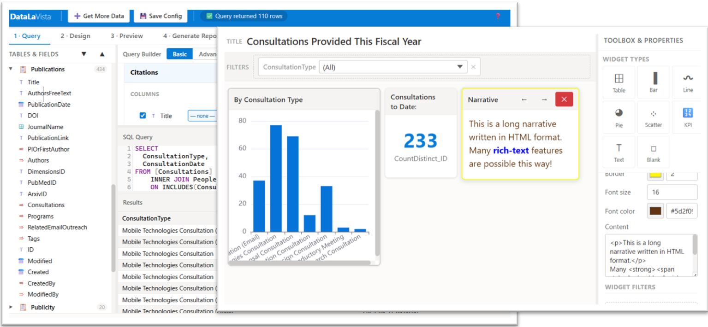

<!--
This file is part of DataLaVista™
README.md
Author(s): Gabriel Mongefranco, Jeremy Gluskin, Shelley Boa.
Created: 2026-03-10
Last Modified: 2026-04-06
Summary: DataLaVista is a ightweight, client-side reporting and dashboard toolkit.
Notes: See README file for documentation and full license information.

Copyright © 2026 The Regents of the University of Michigan

This program is free software: you can redistribute it and/or modify
it under the terms of the GNU General Public License as published by
the Free Software Foundation, either version 3 of the License, or (at your option) any later version.
This program is distributed in the hope that it will be useful,
but WITHOUT ANY WARRANTY; without even the implied warranty of
MERCHANTABILITY or FITNESS FOR A PARTICULAR PURPOSE. See the
GNU General Public License for more details.
You should have received a copy of the GNU General Public License along
with this program. If not, see <https://www.gnu.org/licenses/>.

-->


```text

       /|____________|\
      ||  /--------\  ||    ___       _          _            _    _ _     _
      ||_|__________| ||   |   \ __ _| |_ __ _  | |   __ _  | \  / (_) ___| |_ __ TM
      ||              ||   | |) / _` |  _/ _` | | |__/ _` |  \ \/ /| (_-<  _/ _` |
      | \____________/ |   |___/\__,_|\__\__,_| |____\__,_|   \__/ |_/__/\__\__,_|
       \  |_|_|_|_|  / 
        \___________/         🕶️ "The BI Terminator" ™ 🕶️
```

# 🕶️ DataLaVista™

## Description
<div style="display: flex; justify-content: flex-end;" align="right"><a href="https://doi.org/10.5281/zenodo.19245606" title="DOI" target="_blank" style="align: right;"></a></div>

**🕶️ Tell your expensive BI tools: "Data la vista, baby!"** ™


**DataLaVista**™ is a lightweight, client-side reporting and dashboard toolkit. It brings the full power of SQL directly to your browser, allowing you to build high-performance visualizations without the need for expensive server-side licenses or complex backend infrastructure.

<a href="https://code.depressioncenter.org/datalavista/DataLaVista.html" title="Click to try it live!" target="_blank"></a>

While it was initially designed to dominate SharePoint List items with pure JavaScript widgets that run directly in the browser, Data La Vista is built to be a universal survivor. It aims to be framework-agnostic and designed to plug into any webpage to terminate data silos across REST services, JSON, Excel, and CSV files.

### Come with me if you want to query™
Most enterprise data is trapped behind bloated frameworks or expensive BI tools. Data La Vista terminates them to free your data:

+ Zero Server Footprint: 100% JavaScript. Your browser is the engine.
+ Full SQL Support: Query your SharePoint lists and flat files as if they were a relational database.
+ Pluggable Architecture: Works in SharePoint today; works in React, Vue, or vanilla HTML tomorrow.
+ Format Agnostic: Support for JSON, REST APIs, Excel (XLSX), and CSV is built into the roadmap.

  

## Quick Start Guide
### Live Demo:
+ ***Dashboard View-Mode Demo: [Project Health Dashboard](https://code.depressioncenter.org/datalavista/DataLaVista.html?reportMode=view&report=https://code.depressioncenter.org/datalavista/samples/reports/Project%20Health%20Dashboard.json)***
+ ***Dashboard Designer Demo: [DataLaVista.html](https://code.depressioncenter.org/datalavista/DataLaVista.html)***
  - Use the "Remote Files" tab in the Connect popup and use one of these links to load sample data: [studies.csv](https://code.depressioncenter.org/datalavista/samples/data/studies.csv), [researchers.xml](https://code.depressioncenter.org/datalavista/samples/data/researchers.xml), [participants.json](https://code.depressioncenter.org/datalavista/samples/data/participants.json)
### To use inside a SharePoint Online page:
+ First ensure you have the "Modern Script Editor" app installed. If not available, contact your site administrator to [install it](https://github.com/pnp/sp-dev-fx-webparts/tree/main/samples/react-script-editor)
+ Go to your site's home page and create a new page using the Modern Script Editor template. Use "DataLaVista" for the page title.
+ In the "Modern Script Editor" webpart, click "Markup" then click the "{ }" button to open the code editor.
+ Copy and the paste the code from [DataLaVista.html](DataLaVista.html) into the script editor.
  - Note: if your site has CSP restrictions for JavaScript in place, then use the DataLaVista-nojs.html file instead. Change the script tag for datalavista towards the top of the <head> section to point to /SiteAssets/datlavista.js. Then, upload datalavista.js to your /SiteAssets directory.
+ Save, and refresh the page.
<p>
<a href="https://code.depressioncenter.org/datalavista/presentations/sharepoint-installation-1.mp4" target="_blank" title="Click to open full video with SharePoint installation instructions"></a>
</p>

### To use inside another web app:
+ If using inside a different web platform, follow the same steps as above with whatever method is available for adding scripts to the page. Alternatively, save [DataLaVista.html](DataLaVista.html) to your web server, and add its URL in an iframe tag.
### Load data and design your dashboard:
+ Once the DataLaVista Designer is open, click Connect + Load and enter the location of your data. For SharePoint installations, it should automatically populate the URL for your site in a few seconds. You can also use the different tabs to connect to remote JSON files, CSV, Excel, or to upload a JSON or CSV file.
+ Use the Query Builder and/or SQL Editor to pre-process your data. This will create a flat table, displayed in the preview.
+ Switch to the Design tab to create your dashboard using visuals, tables, or HTML widgets.
+ Switch to the Preview tab to see the final version of your dashboard.
+ Switch to the Generate Report tab. From here, you will see the report configuration in JSON with options to copy, download, or publish to SharePoint.
+ Once your report code is on SharePoint (either as a list item attachment or as a plain .json file in a document library), copy its share link and pass it to DataLaVista (e.g. DataLaVista.html?report=yourlink.json). That will be your shareable link.


## Documentation
+ The full documentation is available at: [https://michmed.org/efdc-kb](https://teamdynamix.umich.edu/TDClient/210/DepressionCenter/KB/ArticleDet?ID=15179)

### Background History
Data La Vista was an idea conceived out of necessity. When our IT department was being too slow to roll out BI tools, the members of the [Automators Anonumous](https://github.com/DepressionCenter/AutomatorsAnonymous) group (a.k.a. Power Automate Lab) at UMich got together and created this tool through many, many iterations of AI prompts! Some of the prompts are included in this project for referene and to give you ideas of what's possible.

Data La Vista does not aim to replace other BI tools completly. This tool is meant to be fast and super easy to use, making it idea for smaller or throw-away reports, for data exploration, and for reporting on SharePoint List data (which is notoriously difficult and messy). The data loading engine makes assumptions about what fields should or should be shown, and adds synthetic fields to make advanced SQL queries easier. Moreover, the focus really is on business and casual users who have lightweight reporting needs.


## Contributing
***I'll be back... with a better report.***
The mission is far from over. Future updates will include:
+ Advanced REST Integration: Seamlessly fetch and join data from multiple API endpoints
+ Excel/CSV Drag-and-Drop: Instant dashboards from local spreadsheets
+ The "Skynet UI Kit"™: A library of aggressive, high-contrast dashboard components
+ Support for Lua, a blazing fast and easy-to-learn scripting language


The initial version was developed in one day by [(@gabrielmongefranco)](https://github.com/gabrielmongefranco), in response to frustration with his IT department delaying access to dashboard licenses in apparent infinity. Continued development is dependent on availability in between work projects. Therefore, your contributions are vital to further developing, refining, and documenting this project! Contact efdc-mobiletech@umich.edu to get in touch, or submit issues, ideas or pull requests via GitHub.


## About the Team
The [Mobile Technologies Core](https://depressioncenter.org/mobiletech) provides investigators across the University of Michigan the support and guidance needed to utilize mobile technologies and digital mental health measures in their studies. Experienced faculty and staff offer hands-on consultative services to researchers throughout the University – regardless of specialty or research focus.

Learn more at: [https://depressioncenter.org/mobiletech](https://depressioncenter.org/mobiletech).


## Contact
To get in touch, contact the individual developers in the check-in history.

If you need assistance identifying a contact person, email the EFDC's Mobile Technologies Core at: efdc-mobiletech@umich.edu.


## Credits
#### Contributors:
+ [Eisenberg Family Depression Center](https://depressioncenter.org) [(@DepressionCenter)](https://github.com/DepressionCenter)
+ [Gabriel Mongefranco](https://gabriel.mongefranco.com) [(@gabrielmongefranco)](https://github.com/gabrielmongefranco)
+ [Jeremy Gluskin](https://mcommunity.umich.edu/person/jgluskin) [(@jerm-ops)](https://github.com/jerm-ops) - Revenue Lifecycle System Coordinator, Quality - Patient Safety, Michigan Medicine.
+ [Shelley Boa](https://mcommunity.umich.edu/person/sboa) [(@blondilox-ai)](https://github.com/blondilox-ai) - Program Manager, Internal Medicine / Pulmonology & Critical Care, Michigan Medicine.
+ The [Automators Anonumous™](https://github.com/DepressionCenter/AutomatorsAnonymous) group.


#### This work is based in part on the following projects, libraries and/or studies:
+ [AlaSQL.js](https://github.com/alasql/alasql) - JavaScript SQL database for browser and Node.js.
+ [Apache ECharts](https://echarts.apache.org/en/index.html) - Free, powerful charting and visualization library offering easy ways to add intuitive, interactive, and highly customizable charts to your commercial products.
+ [CodeMirror](https://codemirror.net/) -  A code editor component for the web, providing SQL syntax highlighting and autocomplete for your queries.
+ [Modern Script Editor](https://github.com/pnp/sp-dev-fx-webparts/tree/main/samples/react-script-editor) - The PnP/SPFX delivery vehicle used to deploy this "Unit" into modern SharePoint environments.
+ [Microsoft SharePoint REST API](https://learn.microsoft.com/en-us/sharepoint/dev/sp-add-ins/get-to-know-the-sharepoint-rest-service) - The primary data uplink for retrieving SharePoint List items and Document Library metadata.


## License
### Copyright Notice
<small><strong>DataLaVista™</strong>, "Come with me if you want to query"™, "The BI Tool Terminator"™, "I'll be back... with a better report"™, "Skynet UI Toolkit"™, "CyberdynePipeline", "I'll be pipeline"™, and "I'll be data processing"™</small> are all trademarks of The Regents of the University of Michigan.
<small>Microsoft, SharePoint, Script Editor, DOI, Zenodo, GNU, GPL, Free Software Foundation, Apache ECharts, AlaSQL, CodeMirror, and other external libraries</small> are all registred marks or trademarks of their respective owners.
Copyright © 2026 The Regents of the University of Michigan


### Software and Library License Notice
This program is free software: you can redistribute it and/or modify it under the terms of the GNU General Public License as published by the Free Software Foundation, either version 3 of the License, or (at your option) any later version.

This program is distributed in the hope that it will be useful, but WITHOUT ANY WARRANTY; without even the implied warranty of MERCHANTABILITY or FITNESS FOR A PARTICULAR PURPOSE. See the GNU General Public License for more details.

You should have received a copy of the GNU General Public License along with this program. If not, see <https://www.gnu.org/licenses/gpl-3.0-standalone.html>.


### Documentation License Notice
Permission is granted to copy, distribute and/or modify this document 
under the terms of the GNU Free Documentation License, Version 1.3 
or any later version published by the Free Software Foundation; 
with no Invariant Sections, no Front-Cover Texts, and no Back-Cover Texts. 
You should have received a copy of the license included in the section entitled "GNU 
Free Documentation License". If not, see <https://www.gnu.org/licenses/fdl-1.3-standalone.html>


## Citation
If you find this repository, code or paper useful for your research, please cite it.

#### Citation Example:
>_Mongefranco, Gabriel; Gluskin, Jeremy; Boa, Shelley (2026). DataLaVista™. University of Michigan. Software. https://github.com/DepressionCenter/datalavista_  
​​​​​​​     _DOI: [https://doi.org/10.5281/zenodo.19245606](https://doi.org/10.5281/zenodo.19245606)_


----

Copyright © 2026 The Regents of the University of Michigan
